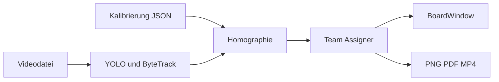

# UniVision2Board

Desktop-Pipeline für die **Post-Game-Analyse** von **Unihockey**-Videos: Spieler-Erkennung (YOLO), Tracking (ByteTrack), Zuordnung der Spielfläche zum **Taktikboard** per Homographie, Teamzuordnung und Export als Bild, PDF und annotiertes Video. Gedacht für die **interne Arbeit mit Trainer:innen**.

Das Python-Paket liegt im Ordner `univision2board/`. Der übergeordnete Arbeitsbereich (Projektstruktur mit `Videos/`, `Taktikboard/`, `output/`) ist unter in der Überordner Ebene **„Projekt 2“** geführt — die Ausgabe-Verzeichnisse beziehen sich auf das **Projektroot** (Verzeichnis direkt über `univision2board/`).

## Funktionen (MVP)

- **Erkennung und Tracking** von Feldspielern im Videostream (YOLO + ByteTrack).
- **Kalibrierung** Videoebene zu Taktikboard (Punktepaare, gespeichert als JSON).
- **Teamzuordnung** per Farbclustering (K-Means) mit manuellen Korrekturen.
- **Live-Ansicht**: Split-Fenster (Video mit Boxes | interaktives Taktikboard).
- **Export**: Standbild PNG + PDF des letzten Board-Frames, MP4 im Split-View.

Details zum Scope: siehe [SCOPE.md](SCOPE.md).

## Voraussetzungen

- **Python** 3.10 oder neuer.
- **GPU** ist optional; Ultralytics/YOLO nutzt CUDA, falls vorhanden.
- Unter **Linux** kann die Qt-/Wayland-Umgebung Zusatzvariablen brauchen (siehe Troubleshooting).
- **Git LFS** ([git-lfs.com](https://git-lfs.com)): nach dem Klonen des Repos im Wurzelverzeichnis `git lfs install` und `git lfs pull`, damit `../finetune/runs/train/weights/best.pt` vollständig geladen wird (Dateigröße grob **> 50 MB** prüfen).
- **Taktikboard:** `../Taktikboard/Taktikboard.png` muss existieren (liegt im Repo, wenn die Abgabe-Konfiguration genutzt wird).
- **Video:** MP4 unter `../Videos/` — z. B. `Abgabe_Demo.mp4` falls mitgeliefert, sonst eigenes Spielvideo dort ablegen.

## Installation

```bash
cd Projekt2/univision2board
python -m venv .venv
source .venv/bin/activate    # Windows: .venv\Scripts\activate
pip install -r requirements.txt
```

Das Standard-YOLO-Gewicht wird relativ zu diesem Ordner erwartet unter:

`../finetune/runs/train/weights/best.pt`

(Bedarfsweise eigenes Modell mit `--model` übergeben.)

## Erster Start

```bash
python run_pipeline.py ../Videos/Abgabe_Demo.mp4
# oder: python run_pipeline.py ../Videos/<dein_video>.mp4
```

Ablauf (mit GUI): Kalibrierungsdialog (Pflicht) → kurzes Team-Warmup → Hauptfenster mit Video und Board während die Verarbeitung läuft.

## Kommandozeilenoptionen


| Option         | Beschreibung                                                                                                         |
| -------------- | -------------------------------------------------------------------------------------------------------------------- |
| `dein_video`        | Pfad zur Videodatei (Pflichtargument).                                                                               |
| `--model`      | Pfad zum YOLO-Gewicht `.pt` (Standard: siehe oben).                                                                  |
| `--calib`      | Explizite Kalibrierungs-JSON; Standard ist `output/exports/calibration_<Video basename>.json` unter dem Projektroot. |
| `--auto-calib` | Ohne Kalibrierungs-GUI: grobe Eck-Zuordnung schreiben, falls keine JSON existiert (nur für Tests / grobe Läufe).     |
| `--conf`       | YOLO-Confidence (Standard: `0.25`).                                                                                  |
| `--step`       | Nur jeden N-ten Frame verarbeiten (Standard: `1`).                                                                   |
| `--no-gui`     | Kein Board-Fenster und kein Kalibrierungs-Dialog; Kalibrierungsdatei muss existieren oder `--auto-calib` setzen.     |


## Ausgaben

Relativ zum **Projektroot** (Ordner über `univision2board/`):


| Ausgabe           | Pfad                                          |
| ----------------- | --------------------------------------------- |
| Kalibrierung      | `output/exports/calibration_<videoname>.json` |
| Board-Standbild   | `output/exports/<videoname>_board.png`        |
| Board-PDF         | `output/exports/<videoname>_board.pdf`        |
| Annotiertes Video | `output/video/<videoname>_annotated.mp4`      |


## Oberfläche (Kurz)

- **Kalibrierung**: Punkte setzen (bis zu 8 Paare), Fenster maximieren, Zoom; **Rechtsklick** auf einen gesetzten Punkt löscht dieses Paar.
- **Board-Fenster**: Werkzeuge (Auswählen, Pass/Schuss/Laufweg zeichnen); **Pause** per Toolbar oder **Leertaste**; Spieler auf dem Board **anklicken** für Teamzuweisung oder **dauerhaftes Ausblenden** eines Tracks für den Rest des Laufes.

## Pipeline (Überblick)




## Tests

```bash
cd univision2board
pytest tests/ -q --ignore=tests/test_gui_manual.py
```

Die Suite kann je nach Hardware **mehrere Minuten** dauern (u.a. Modell/Integration).

## Troubleshooting

- **Qt / „xcb konnte nicht geladen werden“**: OpenCV setzt zuweilen eine eigene `QT_QPA_PLATFORM_PLUGIN_PATH`; die Pipeline versucht, die PyQt5-Plugins zu erzwingen (`run_pipeline.py`, `_fix_qt_plugin_path`). Bei Problemen Umgebungsvariablen prüfen.
- **Wayland (GNOME)**: ggf. starten mit  
`QT_QPA_PLATFORM=wayland python run_pipeline.py ...`

## Lizenz

Noch nicht festgelegt.